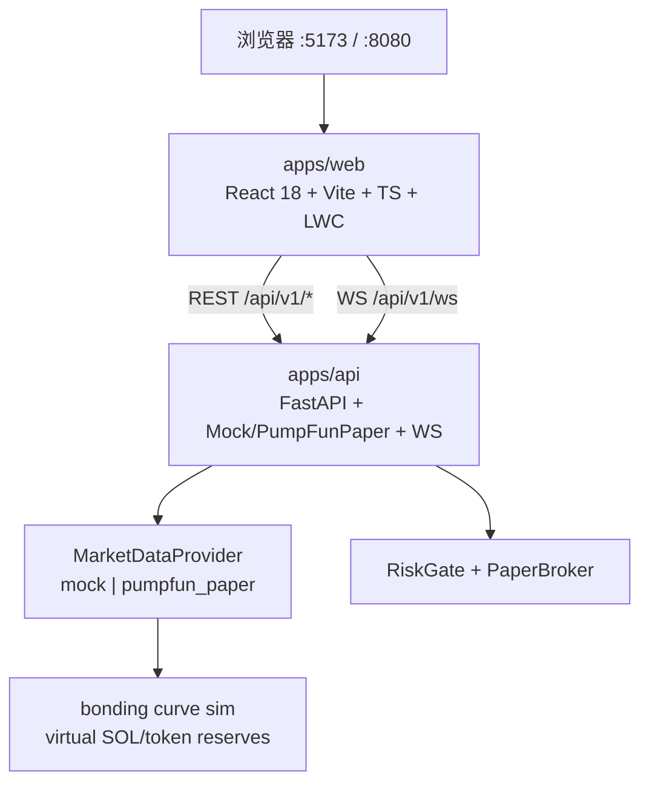

# AUU · pump.fun 纸面量化终端（P0）

**Venue = `pump.fun`（Solana bonding curve）**，不是通用 CEX / Binance 现货。纸面 / Mock 优先。无真实 API Key、无钱包私钥、无自动买币 sniper。图表使用 [lightweight-charts](https://github.com/TradingView/lightweight-charts)（Apache-2.0）；**不**复制 Freqtrade / FreqUI（GPL）代码。

## 架构



| 组件 | 职责 |
|------|------|
| MarketPage `/` | pump mint 自选、K 线、曲线进度、synth 深度、tape、信号/成交叠加 |
| `/trade` | 纸面单：pre-order → paper/orders；dataSource `mock \| paper \| pumpfun_paper` |
| Settings | `venue=pump.fun`、dataSource 占位 `pumpfun_paper` |
| Mock / PumpFunPaperProvider | pump 风格 mock mint；曲线仿真；**不**接 live |

交易对 identity 是 **mock mint**（如 `PmpPEPE1111…`），报价 **SOL**，不是 `BTCUSDT` 现货对。

## 快速启动

### 方式 A：Docker Compose

```bash
cd /workspace/AUU
docker compose up --build
```

- Web: http://localhost:8080  
- API: http://localhost:8000/docs  
- Health: http://localhost:8000/api/v1/health  

### 方式 B：本地双进程（推荐联调）

```bash
# 终端 1 — API
cd /workspace/AUU/apps/api
python3 -m venv .venv && source .venv/bin/activate
pip install -r requirements.txt
export DATA_PROVIDER=mock   # 或 pumpfun_paper（仍是 mock 曲线仿真）
uvicorn app.main:app --reload --host 0.0.0.0 --port 8000

# 终端 2 — Web
cd /workspace/AUU/apps/web
npm install
npm run dev          # http://localhost:5173 ，/api 代理到 :8000
```

可选：复制根目录 `.env.example` → `.env`（**勿填**真实密钥 / 钱包）。

## Mock vs pumpfun_paper vs Real

| | mock（默认） | paper / pumpfun_paper | Real（禁止本轮） |
|--|-------------|----------------------|------------------|
| 行情 | 确定性 RNG 蜡烛 + **曲线仿真** | 同左；overlay 只画 PaperBroker Fill | live pump.fun / RPC **未接** |
| 符号 | mock mint `Pmp…` / SOL | 同左 | — |
| 成交 | demo Fill 或纸面 Fill | RiskGate → PaperBroker | **禁止** 真下单 / sniper |
| 密钥 | 无 | 无 | **禁止** 写入仓库 |

`DATA_PROVIDER=mock|pumpfun_paper`；其它值回退 mock。`PumpFunPaperProvider` 是 `MarketDataProvider` 槽位空壳 + 曲线仿真，**不**实现 live。

## 合同摘要

- REST 包络 `{ ok, data|error }` + 头 `X-Api-Version: 1`
- WS 首帧 `{ type:"hello", version:1, venue:"pump.fun", providers:[…] }`
- 冻结字段：`Candle` · `SignalOut.side=long|short|flat` · `Fill` · `RiskOut{allow,tags}`
- 加法：`SymbolInfo.{mint,venue,curve_progress,virtual_*_reserves,graduated,migrated}`
- `GET /api/v1/curve?symbol=` 曲线快照

详见 `docs/contracts.md`、`docs/pumpfun-venue-v0.md`。

## 试一笔纸面单

纸面 / Mock only。venue=pump.fun。拒单 **不会** 伪造 Fill。

1. 启动 API（`:8000`）+ Web（`:5173`）。
2. Settings：`dataSource` 切 **paper** 或 **pumpfun_paper**。
3. Trade：默认 mint `PmpPEPE1111…`，notional `0.1` SOL → **Buy** / **Sell**。
   - `POST /api/v1/risk/pre-order` → allow 后再 `POST /api/v1/paper/orders`
   - **Wide spread (deny)** → `SPREAD_TOO_WIDE`（随后约 30s cooldown）
4. 行情页看曲线 progress / virt reserves；paper 路径成交点来自 Fill。

```bash
# 默认符号为 pump mock mint
curl -sS http://localhost:8000/api/v1/curve?symbol=PmpPEPE11111111111111111111111111111111111

curl -sS http://localhost:8000/api/v1/pipeline/decide-and-fill \
  -H 'Content-Type: application/json' \
  -d '{"symbol":"PmpPEPE11111111111111111111111111111111111","side":"buy","notional":0.1}'

curl -sS http://localhost:8000/api/v1/pipeline/decide-and-fill \
  -H 'Content-Type: application/json' \
  -d '{"symbol":"PmpPEPE11111111111111111111111111111111111","side":"buy","notional":0.1,"spread_bps":200}'
```

`GET /api/v1/health` 应含 `venue=pump.fun`、`dataSourceOptions=["mock","paper","pumpfun_paper"]`。

## 端口

| 服务 | 端口 |
|------|------|
| API (uvicorn) | **8000** |
| Web (Vite dev) | **5173** |
| Web (docker nginx) | **8080** |

## 许可证注意

优先 Apache/MIT 依赖。不要 fork / 粘贴 GPL 前端（FreqUI 等）。本仓库自研脚手架。
