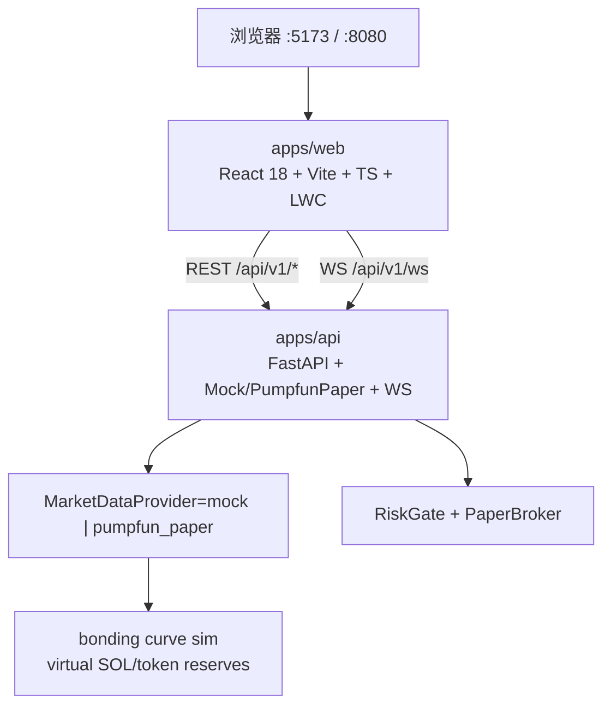

# AUU · Pump.fun 纸面量化终端（P0）

**Venue = `Pump.fun`（Solana bonding curve）**，不是通用 CEX / Binance 现货。纸面 / Mock 优先。无真实 API Key、无钱包私钥、无自动买币 sniper。图表使用 [lightweight-charts](https://github.com/TradingView/lightweight-charts)（Apache-2.0）；**不**复制 Freqtrade / FreqUI（GPL）代码。

## 架构



| 组件 | 职责 |
|------|------|
| MarketPage `/` | 自选、K 线、深度、成交 tape、信号/成交叠加、RiskTagBar、CurveProgressBar / CurvePanel |
| `/trade` | 纸面单：pre-order → paper/orders；可选 one-shot `decide-and-fill`；dataSource `mock \| paper \| pumpfun_paper` |
| Settings | `DATA_PROVIDER=mock\|pumpfun_paper` + `dataSource=mock\|paper\|pumpfun_paper`；venue=Pump.fun |
| Mock provider | 固定 5 个伪模因对；seed=symbol+interval 可复现 |
| pumpfun_paper | 本地 bonding-curve 模拟（venue=Pump.fun，paper-only）；watch-mints env 播种，无钱包密钥 |

`pumpfun_paper` 交易对是 **PUMPDEMO/SOL** 等（mint 为 DemoMint…），报价 **SOL**，不是 `BTCUSDT` 现货对。

## 快速启动

### 方式 A：Docker Compose

```bash
cd /workspace/AUU
docker compose up --build
```

- Web: http://localhost:8080  
- API: http://localhost:8000/docs  
- Health: http://localhost:8000/api/v1/health  

### 方式 B：本地双进程（推荐联调）

```bash
# 终端 1 — API
cd /workspace/AUU/apps/api
python3 -m venv .venv && source .venv/bin/activate
pip install -r requirements.txt
export DATA_PROVIDER=mock   # 或 pumpfun_paper（仍是本地曲线仿真）
uvicorn app.main:app --reload --host 0.0.0.0 --port 8000

# 终端 2 — Web
cd /workspace/AUU/apps/web
npm install
npm run dev          # http://localhost:5173 ，/api 代理到 :8000
```

可选：复制根目录 `.env.example` → `.env`（**勿填**真实密钥 / 钱包）。

## Mock vs pumpfun_paper vs Real

| | Mock（默认） | pumpfun_paper | Live adapter（dark） |
|--|-------------|---------------|----------------------|
| 行情 | 确定性 RNG 蜡烛 / book / trades | 本地 Pump.fun bonding-curve 模拟（venue=Pump.fun，**paper-only**） | 仍走 paper 行情 |
| 信号 | `demo-momentum-v0` 周期 long/short | 同源 demo 叠加 | 不自动下单 |
| 成交 | 纸面 Fill（deny 时不画） | 仍走 **PaperBroker**（无链上 buy/sell） | `LiveBroker` stub；**本轮不发链上 tx** |
| 密钥 | 无 | 无（禁止私钥 / Jito tip / sniper） | **LOCAL-ONLY** `secrets/live-keypair.json`（gitignored）；health 仅 `keypairMounted` + `pubkey` |

切换行情源：环境变量 `DATA_PROVIDER=mock` 或 `DATA_PROVIDER=pumpfun_paper`。  
`pumpfun_paper` 可由 `PUMPFUN_WATCH_MINTS`（逗号分隔 mint 白名单）播种；空则用内置 PUMPDEMO / MOONMOCK / GRADMOCK。只读发现：`PUMPFUN_DISCOVERY=pumpportal|logs|off`（无 `PUMPFUN_PORTAL_API_KEY` 时默认 off）把 `new_token` 写入自选，**不**自动下单。下单路径 `dataSource=mock|paper|pumpfun_paper` 与行情源正交；`paper` / `pumpfun_paper` overlay 只画 PaperBroker Fill。始终 PaperBroker。

有 `ctx.pump` 时 `estimated_impact_bps` 走 bonding-curve（buy/`buy_tokens_out` vs sell/`sell_sol_out`），否则 CEX 平方根。

## 合同摘要

- REST 包络 `{ ok, data|error }` + 头 `X-Api-Version: 1`
- WS 首帧 `{ type:"hello", version:1, providers:["mock","pumpfun_paper"], venue }`，再 `subscribe` channels：`candles|book|trades|signals|fills|risk`；可选 `type:"pumpfun_curve"` / `type:"new_token"`
- 字段：`Candle{symbol,interval,t,o,h,l,c,v}` · `SignalOut.side=long|short|flat` · `Fill` · `RiskOut{allow,tags}` · 可选 `ctx.pump` / `PumpCtx`
- 图上：long→买箭头，short→卖箭头，Fill→方块（菱形近似）；CurveProgressBar 绑 `progress_bps` + `complete`/`migrated`

详见 `docs/contracts.md`、`docs/pumpfun-venue-v0.md`、`docs/pumpfun-integration-v0.md`、`docs/strategies/pump-paper-v1.md`、`docs/viz/paper-stats-v1.md`、`docs/viz/live-ui-gates-v0.md`、`docs/adapters/pumpfun-live-local-signer-v0.md`。

## 自动纸面单 + 成功概率

`strategy_autopaper` / `auto_paper_orders` **默认关**。在 Settings / 行情 / 交易顶栏打开后（无需重启），`pump-paper-v1` 在 `trading_state=active` 时对自选做 decide → RiskGate → PaperBroker。实盘路径关闭（`liveDisabled=true`）；私钥 env 一旦出现则拒绝执行。

**Live adapter**（`docs/adapters/pumpfun-live-local-signer-v0.md`、`docs/viz/live-ui-gates-v0.md`）：`liveEnabled` **默认 false**。独立 `LiveLimits` **1.0 SOL / 单笔**、**日亏 4.5%**、**最多 10 个并发 mint**。拒绝 `LIVE_DISABLED`，除非本机 keypair **mounted** **且**二次确认 **且** liveEnabled **且** LiveLimits。纸面 journal / 胜率永不混入 live。本 PR **不**发送链上交易。

## Local-only keypair mount

AUU **never** asks you to paste, upload, or commit a secret. If you already created a Solana CLI wallet, mount it **on this machine only**:

```bash
# Gitignored. Do not commit, copy into the repo, or paste bytes anywhere.
mkdir -p secrets
# Point at your existing local JSON keypair (Solana CLI array of 64 ints).
# If the wallet came from Phantom, convert the base58 secret locally first.
#   cp /path/on/this/machine/id.json secrets/live-keypair.json
# Or override:
#   export AUU_SOLANA_KEYPAIR_PATH=/absolute/path/on/this/machine/id.json
```

Default path: **`secrets/live-keypair.json`** (see `secrets/README.md`). Env: `AUU_SOLANA_KEYPAIR_PATH`.

`GET /api/v1/health` reports:

| Field | Meaning |
|-------|---------|
| `liveEnabled` | default **false** (stays false until Settings secondary confirm) |
| `keypairMounted` | **bool** — file present and looks like a 64-int Solana JSON keypair |
| `pubkey` | public key (`8fs58PRKhWy8jVkm7Ro6umY2jxbjtoY33LjyUb6YakFi`) or `null` — never secret bytes |
| `liveLimits` | locked **1 / 0.045 / 10** |
| `liveReasons` | includes `LIVE_DISABLED` until mount + secondary confirm + LiveLimits |

Health **never** returns secret bytes, the JSON array, or a private key. `pubkey` is the public key only.

Refuse live orders with `LIVE_DISABLED` unless **all** of: mounted keypair, Settings secondary confirm, `liveEnabled=true`, LiveLimits present.

纸面成功概率（胜率、期望、回撤）来自本会话 `PaperTradeJournal` 已平仓 round-trip（自算，不嵌 QuantStats）。蒙特卡洛默认关：

```bash
curl -sS 'http://localhost:8000/api/v1/strategy/pump-paper-v1/stats'
curl -sS 'http://localhost:8000/api/v1/strategy/pump-paper-v1/stats?mc=1'
curl -sS http://localhost:8000/api/v1/strategy/pump-paper-v1 \
  -X PUT -H 'Content-Type: application/json' \
  -d '{"strategy_autopaper": true}'
```

行情页与交易页有「成功概率 · 纸面模拟」面板。这是纸面历史重抽样，**不是**收益承诺。

## 试一笔纸面单

纸面 / Mock only。venue=Pump.fun。拒单 **不会** 伪造 Fill。

1. 启动 API（`:8000`）+ Web（`:5173`）。建议 `DATA_PROVIDER=pumpfun_paper`。
2. Settings：`dataSource` 切 **paper** 或 **pumpfun_paper**。
3. Trade：默认 `PUMPDEMO/SOL`，notional `0.1` SOL → **Buy** / **Sell**。
   - `POST /api/v1/risk/pre-order` → allow 后再 `POST /api/v1/paper/orders`
   - **Wide spread (deny)** → `SPREAD_TOO_WIDE`（随后约 30s cooldown）
   - **One-shot pipeline** → `POST /api/v1/pipeline/decide-and-fill`（服务端组 ctx + `PumpCtx`）
4. 行情页看曲线 progress / virt reserves；paper 路径成交点来自 Fill。

```bash
export DATA_PROVIDER=pumpfun_paper

curl -sS 'http://localhost:8000/api/v1/health'
curl -sS 'http://localhost:8000/api/v1/curve?symbol=PUMPDEMO/SOL'
curl -sS 'http://localhost:8000/api/v1/pumpfun/snapshot?symbol=PUMPDEMO/SOL'

curl -sS http://localhost:8000/api/v1/pipeline/decide-and-fill \
  -H 'Content-Type: application/json' \
  -d '{"symbol":"PUMPDEMO/SOL","side":"buy","notional":0.1}'

curl -sS http://localhost:8000/api/v1/pipeline/decide-and-fill \
  -H 'Content-Type: application/json' \
  -d '{"symbol":"PUMPDEMO/SOL","side":"buy","notional":0.1,"spread_bps":200}'
```

`GET /api/v1/health` 应含 `venue=Pump.fun`（当 `DATA_PROVIDER=pumpfun_paper`）、`dataSourceOptions=["mock","paper","pumpfun_paper"]`、`strategy_autopaper`。

纸面统计：`GET /api/v1/strategy/pump-paper-v1/stats`（`?mc=1` 才跑蒙特卡洛；`n_trades < 20` 时 `sample_ok=false`，面板「样本不足」）。

可执行性证据（纸面成交能否在曲线上成交，不是“有订单就行”）：

```bash
curl -sS 'http://localhost:8000/api/v1/stats/executability'
```

`verdict=go` 仍 **不会** 打开实盘（`liveEnabled=false`）。门槛见 `docs/research/executability-go-nogo-v0.md`。

## 观察交易员 → 习惯蒸馏（纸面）

观察公开地址 → 习惯标签 → 蒸馏为自有 `pump-paper-v1` 参数。`GET/PUT/DELETE /api/v1/watch/traders` 只存公开地址；`POST .../distill`（只计算）→ `POST /api/v1/strategy/pump-paper-v1/apply-distill` 且 `confirm=true` 才 overlay。**永不**改 `auto_paper_orders`。`sniper` / `graduation_chase` 不自动放宽入场窗。离开 mock 时 P0 读者 = 自选钱包 + Helius/RPC parsed Pump ix + `ctx.pump`（`TRADER_WATCH_READER=helius|rpc`，live HTTP 默认关）。合同：`docs/adapters/trader-watch-distill-v0.md`、数据源 `docs/research/trader-learning-datasources.md`、UI `docs/viz/trader-watch-ui-v0.md`（`/watch`）。

## 端口

| 服务 | 端口 |
|------|------|
| API (uvicorn) | **8000** |
| Web (Vite dev) | **5173** |
| Web (docker nginx) | **8080** |

## 许可证注意

优先 Apache/MIT 依赖。不要 fork / 粘贴 GPL 前端（FreqUI 等）。本仓库自研脚手架。
