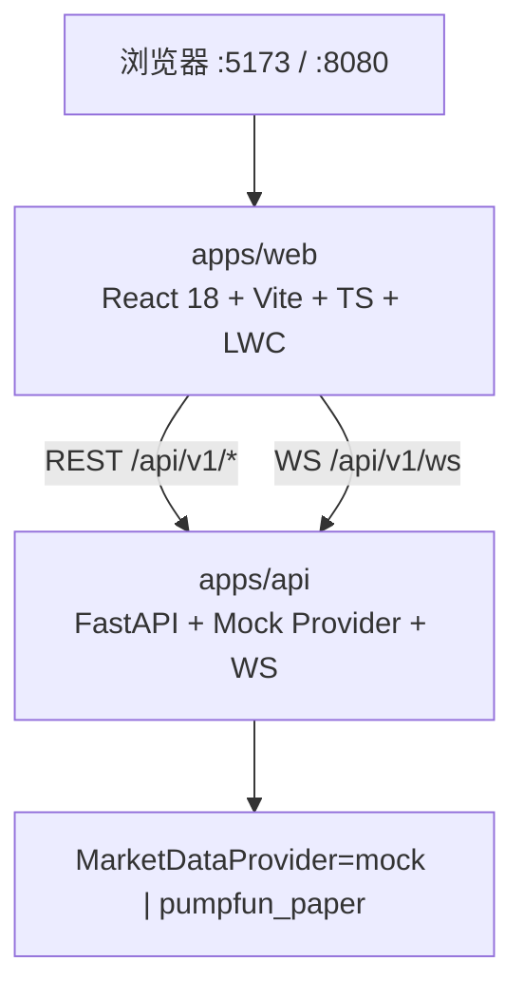

# AUU · 模因币量化可视化行情终端（P0 脚手架）

纸面 / Mock 专用。无真实 API Key、无实盘下单。图表使用 [lightweight-charts](https://github.com/TradingView/lightweight-charts)（Apache-2.0）；**不**复制 Freqtrade / FreqUI（GPL）代码。

## 架构



| 组件 | 职责 |
|------|------|
| MarketPage `/` | 自选、K 线、深度、成交 tape、信号/成交叠加、RiskTagBar、CurveProgressBar |
| `/strategy` `/trade` `/backtest` `/alerts` `/settings` | P0 路由壳；Settings 展示 `DATA_PROVIDER=mock\|pumpfun_paper` + 纸面 PaperBroker |
| Mock provider | 固定 5 个伪模因对；seed=symbol+interval 可复现 |
| pumpfun_paper | 本地 bonding-curve 模拟（venue=Pump.fun，paper-only）；watch-mints env 播种，无钱包密钥 |

## 快速启动

### 方式 A：Docker Compose

```bash
cd /workspace/AUU
docker compose up --build
```

- Web: http://localhost:8080  
- API: http://localhost:8000/docs  
- Health: http://localhost:8000/api/v1/health  

### 方式 B：本地双进程（推荐联调）

```bash
# 终端 1 — API
cd /workspace/AUU/apps/api
python3 -m venv .venv && source .venv/bin/activate
pip install -r requirements.txt
export DATA_PROVIDER=mock
uvicorn app.main:app --reload --host 0.0.0.0 --port 8000

# 终端 2 — Web
cd /workspace/AUU/apps/web
npm install          # 或 pnpm install
npm run dev          # http://localhost:5173 ，/api 代理到 :8000
```

可选：复制根目录 `.env.example` → `.env`（勿填真实密钥）。

## Mock vs pumpfun_paper vs Real

| | Mock（默认） | pumpfun_paper | Real（未实现 / 禁止本轮） |
|--|-------------|---------------|---------------------------|
| 行情 | 确定性 RNG 蜡烛 / book / trades | 本地 Pump.fun bonding-curve 模拟（venue=Pump.fun，**paper-only**） | 后续公共 RPC / DexScreener |
| 信号 | `demo-momentum-v0` 周期 long/short | 同源 demo 叠加 | 真实 StrategyDecision 流 |
| 成交 | 纸面 Fill（deny 时不画） | 仍走 **PaperBroker**（无链上 buy/sell） | 禁止 |
| 密钥 | 无 | 无（禁止私钥 / Jito tip / sniper） | **禁止**写入仓库 |

切换行情源：环境变量 `DATA_PROVIDER=mock` 或 `DATA_PROVIDER=pumpfun_paper`。  
`pumpfun_paper` 可由 `PUMPFUN_WATCH_MINTS`（逗号分隔 mint 白名单）播种；空则用内置 PUMPDEMO / MOONMOCK / GRADMOCK。只读发现：`PUMPFUN_DISCOVERY=pumpportal|logs|off`（无 `PUMPFUN_PORTAL_API_KEY` 时默认 off）把 `new_token` 写入自选，**不**自动下单。下单路径 `dataSource=mock|paper` 与行情源正交，始终 PaperBroker。

## 合同摘要

- REST 包络 `{ ok, data|error }` + 头 `X-Api-Version: 1`
- WS 首帧 `{ type:"hello", version:1, providers:["mock","pumpfun_paper"] }`，再 `subscribe` channels：`candles|book|trades|signals|fills|risk`；可选 `type:"pumpfun_curve"` / `type:"new_token"`
- 字段：`Candle{symbol,interval,t,o,h,l,c,v}` · `SignalOut.side=long|short|flat` · `Fill` · `RiskOut{allow,tags}` · 可选 `ctx.pump` / `PumpCtx`
- 图上：long→买箭头，short→卖箭头，Fill→方块（菱形近似）；CurveProgressBar 绑 `progress_bps` + `complete`/`migrated`

详见 `docs/contracts.md`。

## 端口

| 服务 | 端口 |
|------|------|
| API (uvicorn) | **8000** |
| Web (Vite dev) | **5173** |
| Web (docker nginx) | **8080** |

## 许可证注意

优先 Apache/MIT 依赖。不要 fork / 粘贴 GPL 前端（FreqUI 等）。本仓库自研脚手架。
