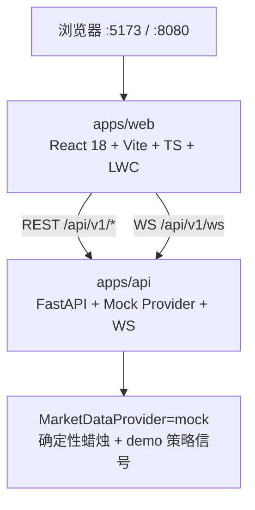

# AUU · 模因币量化可视化行情终端（P0 脚手架）

纸面 / Mock 专用。无真实 API Key、无实盘下单。图表使用 [lightweight-charts](https://github.com/TradingView/lightweight-charts)（Apache-2.0）；**不**复制 Freqtrade / FreqUI（GPL）代码。

## 架构



| 组件 | 职责 |
|------|------|
| MarketPage `/` | 自选、K 线、深度、成交 tape、信号/成交叠加、RiskTagBar |
| `/strategy` `/trade` `/backtest` `/alerts` `/settings` | P0 路由壳；Settings 展示 `DATA_PROVIDER=mock` |
| Mock provider | 固定 5 个伪模因对；seed=symbol+interval 可复现 |

## 快速启动

### 方式 A：Docker Compose

```bash
cd /workspace/AUU
docker compose up --build
```

- Web: http://localhost:8080  
- API: http://localhost:8000/docs  
- Health: http://localhost:8000/api/v1/health  

### 方式 B：本地双进程（推荐联调）

```bash
# 终端 1 — API
cd /workspace/AUU/apps/api
python3 -m venv .venv && source .venv/bin/activate
pip install -r requirements.txt
export DATA_PROVIDER=mock
uvicorn app.main:app --reload --host 0.0.0.0 --port 8000

# 终端 2 — Web
cd /workspace/AUU/apps/web
npm install          # 或 pnpm install
npm run dev          # http://localhost:5173 ，/api 代理到 :8000
```

可选：复制根目录 `.env.example` → `.env`（勿填真实密钥）。

## Mock vs Real

| | Mock（默认） | Real（未实现 / 禁止本轮） |
|--|-------------|---------------------------|
| 行情 | 确定性 RNG 蜡烛 / book / trades | 后续 `ccxt_public` / DexScreener 官方 API |
| 信号 | `demo-momentum-v0` 周期 long/short | 真实 StrategyDecision 流 |
| 成交 | 纸面 Fill（deny 时不画） | PaperBroker 同源回放 |
| 密钥 | 无 | **禁止**写入仓库 |

切换：环境变量 `DATA_PROVIDER=mock`（P0 仅 mock；其它值回退 mock）。

## 合同摘要

- REST 包络 `{ ok, data|error }` + 头 `X-Api-Version: 1`
- WS 首帧 `{ type:"hello", version:1, providers:["mock"] }`，再 `subscribe` channels：`candles|book|trades|signals|fills|risk`
- 字段：`Candle{symbol,interval,t,o,h,l,c,v}` · `SignalOut.side=long|short|flat` · `Fill` · `RiskOut{allow,tags}`
- 图上：long→买箭头，short→卖箭头，Fill→方块（菱形近似）

详见 `docs/contracts.md`。

## 试一笔纸面单

纸面 / Mock only。无交易所密钥。拒单 **不会** 伪造 Fill。

1. 按上方启动 API（`:8000`）+ Web（`:5173`）。
2. 打开 [Settings](http://localhost:5173/settings) 把 `dataSource` 切到 **paper**（行情图只叠加 PaperBroker Fill；mock 信号仍保留）。
3. 打开 [Trade](http://localhost:5173/trade)：
   - 输入 notional（默认 `500`），点 **Buy** 或 **Sell**。
   - 前端先 `POST /api/v1/risk/pre-order`，`allow=true` 后再 `POST /api/v1/paper/orders`。
   - HTTP 结果区显示 Fill 或 Reject；右侧 WS tape 收 `signal|risk|fill|reject|trading_state`。
   - 勾选 **Wide spread (deny)** 可走 `SPREAD_TOO_WIDE` 拒单（随后该 symbol 约 30s cooldown）。
4. 回到行情页 `/`：paper 模式下成交点来自 Fill；reject 不画点。

可选一枪（服务端用 mock mid/book 组 `StrategyContext`，发同样的 WS 事件）：

```bash
curl -sS http://localhost:8000/api/v1/pipeline/decide-and-fill \
  -H 'Content-Type: application/json' \
  -d '{"symbol":"MOCK/USDC","side":"buy","notional":500}'

# deny 样例
curl -sS http://localhost:8000/api/v1/pipeline/decide-and-fill \
  -H 'Content-Type: application/json' \
  -d '{"symbol":"MOCK/USDC","side":"buy","notional":500,"spread_bps":200}'
```

两步拆开（与 Trade 页相同）：

```bash
# 1) pre-order — 可用扁平字段；或先 GET /api/v1/book?symbol=MOCK/USDC 组 ctx
curl -sS http://localhost:8000/api/v1/risk/pre-order \
  -H 'Content-Type: application/json' \
  -d '{"symbol":"MOCK/USDC","signal":{"side":"long"},"size":{"target_notional":500}}'

# 2) paper/orders — 需 risk.allow=true 的 RiskOut + ctx + intent
```

`GET /api/v1/health` 应返回 `mode=paper`、`dataSourceOptions=["mock","paper"]`。

## 端口

| 服务 | 端口 |
|------|------|
| API (uvicorn) | **8000** |
| Web (Vite dev) | **5173** |
| Web (docker nginx) | **8080** |

## 许可证注意

优先 Apache/MIT 依赖。不要 fork / 粘贴 GPL 前端（FreqUI 等）。本仓库自研脚手架。
