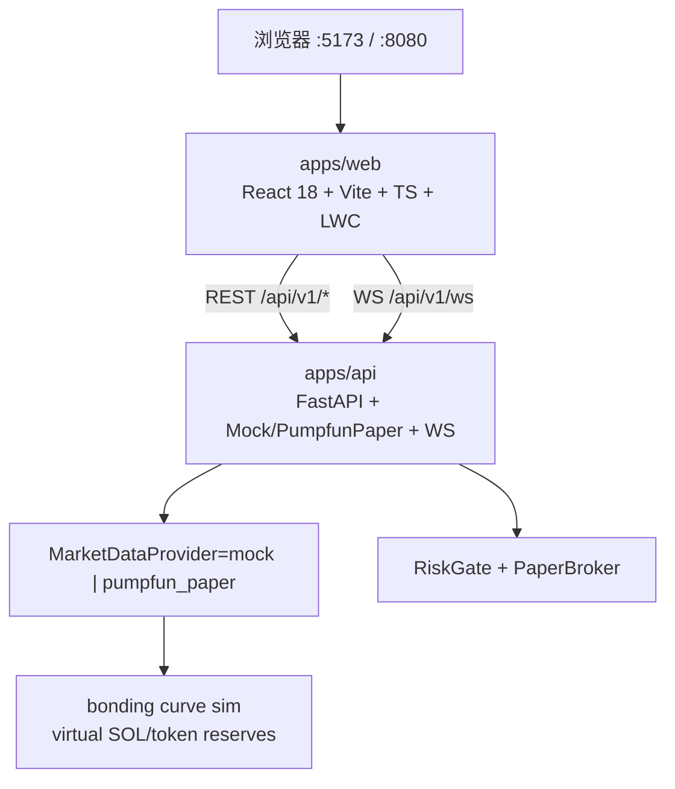

# AUU · 主流币量化平台（纸面）

**方向（2026-10）：** AUU 已放弃 pump.fun / 模因币，转为 **主流币（BTC / ETH / SOL，可配置）量化研究与纸面交易平台**。计划见 `docs/mainstream/plan.md`（M0 归档旧栈 → M1 行情层 → M2+ 趋势 TSMOM 回测 / 纸面 / Go-No-Go）。

- 行情只用交易所 **公开** 接口（[ccxt](https://github.com/ccxt/ccxt)，MIT），**无 API key、无付费数据、不下单**。
- 实盘保持锁定：`LIVE_API_LOCKED`，网页 / HTTP 无法打开 live（服务端 `AUU_LIVE_API_ENABLE` 未开启时恒 403）。
- 登录、邮箱验证码、邀请码、锁定、CSRF 来源校验、管理员写权限、纸面账本、Go/No-Go、health/guard 全部保留。
- 不合并 GPL / AGPL 代码（不使用 freqtrade 等代码）。

## 当前模式与旧版开关

| 模式 | 开关 | 启动内容 |
|------|------|----------|
| **主流（默认）** | `AUU_LEGACY_PUMP` 未设或 `off` | 主流行情层（K 线 + 资金费率刷新循环）、登录、大盘 `/majors`、控制台事件、纸面绩效 / Go-No-Go `GET /api/v1/stats/paper-performance`、live 状态（只读锁定） |
| 旧版 pump.fun | `AUU_LEGACY_PUMP=on` | 额外挂载并启动 `app/legacy/pump/` 下的全部旧功能（pump provider feed、发现、pump-paper-v1 循环、交易员观察、钱包、盘面 / 市场 / 交易 / 复盘等路由），与迁移前行为一致 |

旧代码用 `git mv` 移到 `apps/api/app/legacy/pump/`（保留历史；放在 `app` 包内以便 import），测试移到 `apps/api/tests/legacy_pump/`。关闭时这些模块不会被 import 启动；`DATA_PROVIDER=pumpfun_*` 残留也只会回落到无害的 mock。health 在主流模式返回 `provider=cex_public`、`legacyPump=false`、`autopaperStall.stalled=false`（`reason=no_running_strategy`：只有真正运行中的策略才会触发停滞告警）。

## 主流行情层（M1）

代码：`apps/api/app/marketdata/mainstream/`（`config.py` / `fetcher.py` / `store.py` / `service.py`），路由 `apps/api/app/routes/mainstream.py`，页面 `/`（主流行情，登录后可见）。

- 数据：每个币的现货 `BASE/USDT` **1d、1h K 线** + 永续 `BASE/USDT:USDT` **资金费率历史**（及当前费率）。
- 存储：SQLite `AUU_DATA_DIR/mainstream.sqlite`（表 `candles` / `funding` / `fetch_log`）。增量更新（从最后一根继续）、缺口检测与补洞、指数退避重试（1s / 2s / 4s…）。
- 交易所：`auto` 时依次尝试 Binance → OKX；某所地区封锁（HTTP 451 / 403）或整轮失败时自动切到下一所，并在 health / 页面显示 `blocked`。
- 只读 API（全部需要登录，未登录 401）：
  - `GET /api/v1/mainstream/overview` — 价格、24h / 30d 涨跌、资金费率（最近 / 当前 / 年化）、新鲜度
  - `GET /api/v1/mainstream/candles?symbol=BTC&tf=1d|1h&limit=&since=`
  - `GET /api/v1/mainstream/funding?symbol=BTC&limit=&since=`
  - `GET /api/v1/mainstream/status` — 新鲜度（同 health 的 `mainstream` 字段）
- health 字段 `mainstream`：`exchange`、`blocked`、`lastRefreshMs`、每个序列的 `lastTs/ageMin/stale`、`staleSeries`、`gaps`。过期阈值：1h 线 180 分钟、1d 线 49 小时、资金费率 12.5 小时。guard 对过期只告警（`DATA STALE WARN`），不停服务。

| 环境变量 | 默认 | 说明 |
|----------|------|------|
| `AUU_LEGACY_PUMP` | `off` | `on` 重新启用旧 pump.fun 栈 |
| `AUU_MAINSTREAM_DATA` | `on` | 关闭整个主流行情层 |
| `AUU_MAINSTREAM_SYMBOLS` | `BTC,ETH,SOL` | 逗号分隔 base 币 |
| `AUU_MAINSTREAM_QUOTE` | `USDT` | 计价币 |
| `AUU_MAINSTREAM_EXCHANGE` | `auto` | `binance` / `okx` / `auto`（或 `okx,binance` 指定顺序） |
| `AUU_MAINSTREAM_REFRESH` | `on` | 后台刷新循环 |
| `AUU_MAINSTREAM_REFRESH_SEC` | `300` | 刷新间隔（秒） |
| `AUU_MAINSTREAM_BACKFILL_1D_DAYS` / `_1H_DAYS` | `730` / `90` | 首次回补天数 |
| `AUU_MAINSTREAM_FUNDING_DAYS` | `60` | 资金费率首次回补天数（OKX 公共接口只给约 3 个月） |
| `AUU_MAINSTREAM_RETRIES` | `3` | 单次请求重试次数 |

研究回测脚本在 box 的 `/workspace/mainstream/`（不在仓库内；M2 会把它产品化为回测引擎）。

---

以下为 **旧版 pump.fun 终端** 文档（仅 `AUU_LEGACY_PUMP=on` 时适用）。

# 旧版 · Pump.fun 纸面量化终端（legacy）

**Venue = `Pump.fun`（Solana bonding curve）**，不是通用 CEX / Binance 现货。纸面 / Mock 优先。无真实 API Key、无钱包私钥、无自动买币 sniper。图表使用 [lightweight-charts](https://github.com/TradingView/lightweight-charts)（Apache-2.0）；**不**复制 Freqtrade / FreqUI（GPL）代码。

## 架构


```mermaid
flowchart TB
  Browser["浏览器 :5173 / :8080"]
  Web["apps/web<br/>React 18 + Vite + TS + LWC"]
  API["apps/api<br/>FastAPI + Mock/PumpfunPaper + WS"]
  Browser --> Web
  Web -->|"REST /api/v1/*"| API
  Web -->|"WS /api/v1/ws"| API
  API --> Mock["MarketDataProvider=mock | pumpfun_paper"]
  Mock --> Curve["bonding curve sim<br/>virtual SOL/token reserves"]
  API --> Paper["RiskGate + PaperBroker"]
```

| 组件 | 职责 |
|------|------|
| ConsolePage `/console` | 控制台：持仓 / 今日平仓 / 今日净盈亏 / Go-No-Go，纸面事件流（`GET /api/v1/events?since=`，只读） |
| BoardPage `/`（旧版模式；主流模式下为 `/board`） | 盘面：监控涨跌条、纸面权益曲线、平仓 tape、胜率 / 期望 / 笔数 / Go-No-Go、持仓、影子对照（`GET /api/v1/board`，只读） |
| MarketsPage `/markets` | 市场：pump.fun 全站表（`GET /api/v1/universe`，热门 / 新币 / 即将毕业 / 已毕业 / 涨跌榜 / 观察池）。与发现模式无关。本地模拟币只在 `AUU_UNIVERSE_MOCK=1` 时出现。点行进入 `/trade/:mint` |
| TradingPage `/trade` | 交易：全站搜索（`GET /api/v1/search`，pump.fun，失败则 DexScreener）、任意 mint 报价、纸面买卖票。单笔 1 SOL、10 仓、日亏 4.5%。`liveEnabled` 恒 false |
| MajorsPage `/majors` | 大盘：各所成交额前 100 的 USDT/USD（`GET /api/v1/majors/tickers`），涨跌筛选，跨所买卖价差。无密钥、无下单。单所不可用时其余继续。所址可用 `BINANCE_REST_URL` / `OKX_REST_URL` / `BYBIT_REST_URL` / `COINBASE_MARKET_URL` |
| MarketPage `/market` | 自选、K 线、深度、成交 tape、信号/成交叠加、RiskTagBar、CurveProgressBar / CurvePanel |
| `/positions` | 本地（`AUU_AUTH` 未开）仍是旧纸面单面板。开启账户后只显示当前用户的纸面仓；管理员可切换查看其他人 |
| LeaderboardPage `/leaderboard` | 排行榜：用户纸面已实现盈亏 / 收益率。系统纸面引擎不计入。无充值、无提现、无实盘 |
| LoginPage `/login` | 登录。`AUU_AUTH=off`（本地默认）不要求登录。部署（Compose）默认 `AUU_AUTH=on` |
| RegisterPage `/register` | 公开注册：用户名、密码、确认密码，可选显示名。`AUU_INVITE_CODE` 不设置则开放注册；`AUU_ALLOW_SIGNUP=false` 关闭注册。密码只存 bcrypt 哈希。`AUU_EMAIL_VERIFY=on` 时需填邮箱并输入 6 位邮箱验证码（10 分钟有效，60 秒可重发，错 5 次失效），邮箱不可重复；发件用 `AUU_SMTP_HOST/PORT/USER/PASS`（Gmail：smtp.gmail.com 465/587 + 应用专用密码；QQ：smtp.qq.com 465 + 授权码；163：smtp.163.com 465 + 授权码；可用 `AUU_SMTP_STARTTLS` 覆盖端口推断） |
| ForgotPasswordPage `/forgot-password` | 忘记密码：邮箱验证码重置密码，重置后该用户所有旧会话失效。仅在 `AUU_EMAIL_VERIFY=on` 时可用 |
| Settings | 修改密码；非托管钱包（公钥绑定、devnet memo，默认关）；`DATA_PROVIDER=mock\|pumpfun_paper` + `dataSource=mock\|paper\|pumpfun_paper`；venue=Pump.fun |
| Mock provider | 固定 5 个伪模因对；seed=symbol+interval 可复现 |
| pumpfun_paper | 本地 bonding-curve 模拟（venue=Pump.fun，paper-only）；watch-mints env 播种，无钱包密钥 |

`pumpfun_paper` 交易对是 **PUMPDEMO/SOL** 等（mint 为 DemoMint…），报价 **SOL**，不是 `BTCUSDT` 现货对。

## 快速启动

### 方式 A：Docker Compose

```bash
cd /workspace/AUU
docker compose up --build
```

- Web: http://localhost:8080  
- API: http://localhost:8000/docs  
- Health: http://localhost:8000/api/v1/health  

### 方式 B：本地双进程（推荐联调）

```bash
# 终端 1 — API
cd /workspace/AUU/apps/api
python3 -m venv .venv && source .venv/bin/activate
pip install -r requirements.txt
# 默认主流模式；旧版：export AUU_LEGACY_PUMP=on DATA_PROVIDER=pumpfun_live_paper
uvicorn app.main:app --reload --host 0.0.0.0 --port 8000

# 终端 2 — Web
cd /workspace/AUU/apps/web
npm install
npm run dev          # http://localhost:5173 ，/api 代理到 :8000
```

可选：复制根目录 `.env.example` → `.env`（**勿填**真实密钥 / 钱包）。

## Mock vs pumpfun_paper vs Real

| | Mock（默认） | pumpfun_paper | pumpfun_live_paper | Live adapter（dark） |
|--|-------------|---------------|--------------------|----------------------|
| 行情 | 确定性 RNG 蜡烛 / book / trades | 本地 bonding-curve 模拟，`synthetic=true` | 真实成交与虚拟储备，无成交则价格不动 | 仍走 paper 行情 |
| 统计 | 纸面 | **不进** Go / 影子对比 / 排行榜 | `marketData=real`，新窗口从零计 | 不混入纸面胜率 |
| 成交 | 纸面 Fill | **PaperBroker** | 曲线报价（含协议费）+ 决策延迟后的第一笔真实成交 | `LiveBroker` stub；**不发链上 tx** |
| 密钥 | 无 | 无 | 无（只读 WS / logs） | **LOCAL-ONLY** `secrets/live-keypair.json`（gitignored） |

切换行情源：`DATA_PROVIDER=mock`、`DATA_PROVIDER=pumpfun_paper` 或 `DATA_PROVIDER=pumpfun_live_paper`。health 字段 `marketData` 为 `mock` / `synthetic` / `real`。  
`pumpfun_paper` 可由 `PUMPFUN_WATCH_MINTS` 播种；空则用内置 PUMPDEMO / MOONMOCK / GRADMOCK，且 `synthetic=true` 的成交不进入 Go。`pumpfun_live_paper` 不载入演示 mint，只接受经链上 bonding-curve 账户校验（owner=pump 程序、`complete=false`）的币；行情来自 PumpPortal `subscribeTokenTrade` 和/或 `logsSubscribe` 解码 TradeEvent（`LIVE_PAPER_FEED=auto|portal|logs|off`）。详见 `docs/adapters/pumpfun-live-paper-v0.md`；旧数据清理 `python -m app.paper.legacy_cleanup`（默认 dry-run，`--apply` 才写）。只读发现：`PUMPFUN_DISCOVERY=pumpportal|logs|off`（无 `PUMPFUN_PORTAL_API_KEY` 时默认 off）。Portal HTTP 400/403 → health `discoveryReason=portal_auth_rejected`（见 `docs/adapters/pumpportal-discovery-v0.md`）。下单路径 `dataSource=mock|paper|pumpfun_paper` 与行情源正交。始终 PaperBroker，`liveEnabled` 默认 false。

有 `ctx.pump` 时 `estimated_impact_bps` 走 bonding-curve（buy/`buy_tokens_out` vs sell/`sell_sol_out`），否则 CEX 平方根。

## 合同摘要

- REST 包络 `{ ok, data|error }` + 头 `X-Api-Version: 1`
- WS 首帧 `{ type:"hello", version:1, providers:["mock","pumpfun_paper","pumpfun_live_paper"], venue, marketData }`，再 `subscribe` channels：`candles|book|trades|signals|fills|risk`；可选 `type:"pumpfun_curve"` / `type:"new_token"`
- 字段：`Candle{symbol,interval,t,o,h,l,c,v}` · `SignalOut.side=long|short|flat` · `Fill` · `RiskOut{allow,tags}` · 可选 `ctx.pump` / `PumpCtx`
- 图上：long→买箭头，short→卖箭头，Fill→方块（菱形近似）；CurveProgressBar 绑 `progress_bps` + `complete`/`migrated`

详见 `docs/contracts.md`、`docs/pumpfun-venue-v0.md`、`docs/pumpfun-integration-v0.md`、`docs/strategies/pump-paper-v1.md`、`docs/viz/paper-stats-v1.md`、`docs/viz/live-ui-gates-v0.md`、`docs/adapters/pumpfun-live-local-signer-v0.md`、`docs/adapters/wallet-noncustodial-v0.md`。

## 自动纸面单 + 成功概率

`strategy_autopaper` / `auto_paper_orders` **默认关**。在 Settings / 行情 / 交易顶栏打开后（无需重启），`pump-paper-v1` 在 `trading_state=active` 时对自选做 decide → RiskGate → PaperBroker。实盘路径关闭（`liveDisabled=true`）；私钥 env 一旦出现则拒绝执行。

**Live adapter**（`docs/adapters/pumpfun-live-local-signer-v0.md`、`docs/viz/live-ui-gates-v0.md`）：`liveEnabled` **默认 false**。独立 `LiveLimits` **1.0 SOL / 单笔**、**日亏 4.5%**、**最多 10 个并发 mint**。拒绝 `LIVE_DISABLED`，除非本机 keypair **mounted** **且**二次确认 **且** liveEnabled **且** LiveLimits。纸面 journal / 胜率永不混入 live。本 PR **不**发送链上交易。

## Local-only keypair mount

AUU **never** asks you to paste, upload, or commit a secret. If you already created a Solana CLI wallet, mount it **on this machine only**:

```bash
# Gitignored. Do not commit, copy into the repo, or paste bytes anywhere.
mkdir -p secrets
# Point at your existing local JSON keypair (Solana CLI array of 64 ints).
# If the wallet came from Phantom, convert the base58 secret locally first.
#   cp /path/on/this/machine/id.json secrets/live-keypair.json
# Or override:
#   export AUU_SOLANA_KEYPAIR_PATH=/absolute/path/on/this/machine/id.json
```

Default path: **`secrets/live-keypair.json`** (see `secrets/README.md`). Env: `AUU_SOLANA_KEYPAIR_PATH`.

`GET /api/v1/health` reports:

| Field | Meaning |
|-------|---------|
| `liveEnabled` | default **false** (stays false until Settings secondary confirm) |
| `keypairMounted` | **bool** — file present and looks like a 64-int Solana JSON keypair |
| `pubkey` | public key (`8fs58PRKhWy8jVkm7Ro6umY2jxbjtoY33LjyUb6YakFi`) or `null` — never secret bytes |
| `liveLimits` | locked **1 / 0.045 / 10** |
| `liveReasons` | includes `LIVE_DISABLED` until mount + secondary confirm + LiveLimits |

Health **never** returns secret bytes, the JSON array, or a private key. `pubkey` is the public key only.

Refuse live orders with `LIVE_DISABLED` unless **all** of: mounted keypair, Settings secondary confirm, `liveEnabled=true`, LiveLimits present.

纸面成功概率（胜率、期望、回撤）来自本会话 `PaperTradeJournal` 已平仓 round-trip（自算，不嵌 QuantStats）。蒙特卡洛默认关：

```bash
curl -sS 'http://localhost:8000/api/v1/strategy/pump-paper-v1/stats'
curl -sS 'http://localhost:8000/api/v1/strategy/pump-paper-v1/stats?mc=1'
curl -sS http://localhost:8000/api/v1/strategy/pump-paper-v1 \
  -X PUT -H 'Content-Type: application/json' \
  -d '{"strategy_autopaper": true}'
```

行情页与交易页有「成功概率 · 纸面模拟」面板。这是纸面历史重抽样，**不是**收益承诺。

## 非托管钱包

设置页可以连接 Phantom 或 Solflare，用 `signMessage` 绑定公钥。服务端只存公钥，用 ed25519 验签，不保存私钥，不托管资金，不代签名，不自动下单。`liveEnabled` 仍默认 false。钱包流水单独存放，不进入纸面 journal，也不计入 Go/No-Go 或影子对照。

`AUU_WALLET_MODE` 默认 `off`。设为 `devnet` 后，已绑定并勾选风险提示的用户可以签一笔金额为 0 的 devnet memo。设为 `mainnet` 后，交易页才出现真钱买入/卖出：服务端只组未签名交易，用户在自己的钱包里签名，服务端核对签名和交易内容后再用 `SOLANA_RPC_URL_MAINNET` 广播。管理员可以一键关闭所有人的钱包模式。部署时不要把任何私钥放上服务器，也不要把带密钥的 RPC URL 打进前端。

说明、环境变量和风险提示全文见 `docs/adapters/wallet-noncustodial-v0.md`。

## 试一笔纸面单

纸面 / Mock only。venue=Pump.fun。拒单 **不会** 伪造 Fill。

1. 启动 API（`:8000`）+ Web（`:5173`）。建议 `DATA_PROVIDER=pumpfun_paper`。
2. Settings：`dataSource` 切 **paper** 或 **pumpfun_paper**。
3. Trade：默认 `PUMPDEMO/SOL`，notional `0.1` SOL → **Buy** / **Sell**。
   - `POST /api/v1/risk/pre-order` → allow 后再 `POST /api/v1/paper/orders`
   - **Wide spread (deny)** → `SPREAD_TOO_WIDE`（随后约 30s cooldown）
   - **One-shot pipeline** → `POST /api/v1/pipeline/decide-and-fill`（服务端组 ctx + `PumpCtx`）
4. 行情页看曲线 progress / virt reserves；paper 路径成交点来自 Fill。

```bash
export DATA_PROVIDER=pumpfun_paper

curl -sS 'http://localhost:8000/api/v1/health'
curl -sS 'http://localhost:8000/api/v1/curve?symbol=PUMPDEMO/SOL'
curl -sS 'http://localhost:8000/api/v1/pumpfun/snapshot?symbol=PUMPDEMO/SOL'

curl -sS http://localhost:8000/api/v1/pipeline/decide-and-fill \
  -H 'Content-Type: application/json' \
  -d '{"symbol":"PUMPDEMO/SOL","side":"buy","notional":0.1}'

curl -sS http://localhost:8000/api/v1/pipeline/decide-and-fill \
  -H 'Content-Type: application/json' \
  -d '{"symbol":"PUMPDEMO/SOL","side":"buy","notional":0.1,"spread_bps":200}'
```

`GET /api/v1/health` 应含 `venue=Pump.fun`（当 `DATA_PROVIDER=pumpfun_paper`）、`dataSourceOptions=["mock","paper","pumpfun_paper"]`、`strategy_autopaper`。

纸面统计：`GET /api/v1/strategy/pump-paper-v1/stats`（`?mc=1` 才跑蒙特卡洛；`n_trades < 20` 时 `sample_ok=false`，面板「样本不足」）。

可执行性证据（纸面成交能否在曲线上成交，不是“有订单就行”）：

```bash
curl -sS 'http://localhost:8000/api/v1/stats/executability'
```

`verdict=go` 仍 **不会** 打开实盘（`liveEnabled=false`）。门槛见 `docs/research/executability-go-nogo-v0.md`。

## 观察交易员 → 习惯蒸馏（纸面）

观察公开地址 → 习惯标签 → 蒸馏为自有 `pump-paper-v1` 参数。`GET/PUT/DELETE /api/v1/watch/traders` 只存公开地址；`POST .../distill`（只计算）→ `POST /api/v1/strategy/pump-paper-v1/apply-distill` 且 `confirm=true` 才 overlay。**永不**改 `auto_paper_orders`。`sniper` / `graduation_chase` 不自动放宽入场窗。离开 mock 时 P0 读者 = 自选钱包 + Helius/RPC parsed Pump ix + `ctx.pump`（`TRADER_WATCH_READER=helius|rpc`，live HTTP 默认关）。合同：`docs/adapters/trader-watch-distill-v0.md`、数据源 `docs/research/trader-learning-datasources.md`、UI `docs/viz/trader-watch-ui-v0.md`（`/watch`）。

## 端口

| 服务 | 端口 |
|------|------|
| API (uvicorn) | **8000** |
| Web (Vite dev) | **5173** |
| Web (docker nginx) | **8080** |

## 许可证注意

优先 Apache/MIT 依赖（ccxt 为 MIT，其依赖为 MIT / Apache-2.0 / BSD / PSF / MPL-2.0）。不要 fork / 粘贴 GPL / AGPL 代码（FreqUI、freqtrade 等）。本仓库自研脚手架。
