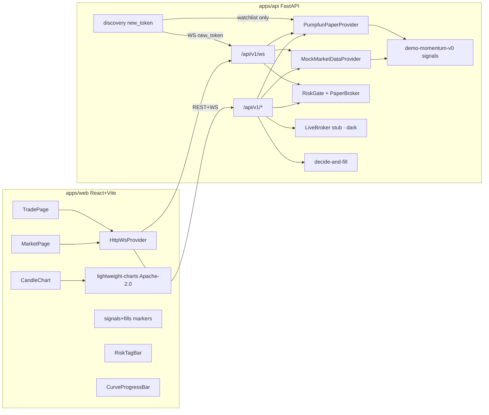

# 架构速览

- **Venue** `Pump.fun`（Solana bonding curve）when `DATA_PROVIDER=pumpfun_paper`。符号 = `PUMPDEMO/SOL` 等，报价 SOL。
- **默认** `DATA_PROVIDER=mock`：确定性 RNG 蜡烛 + 周期信号/成交/风控。
- **`DATA_PROVIDER=pumpfun_paper`**：本地 Pump.fun bonding-curve 模拟（venue=Pump.fun，paper-only）。`PUMPFUN_WATCH_MINTS` 白名单播种；只读发现 `PUMPFUN_DISCOVERY=pumpportal|logs|off` 可将 `new_token` 写入自选（不等于入场）。无钱包、无 `sendTransaction`。进度条绑 `progress_bps` + `complete`/`migrated`。
- **下单**：始终 `PaperBroker` + `RiskGate`。`dataSource=mock|paper|pumpfun_paper` 与行情源正交；`paper` / `pumpfun_paper` overlay 只画 PaperBroker Fill。有 `ctx.pump` 时 `estimated_impact_bps` 走 bonding-curve（buy/`buy_tokens_out` vs sell/`sell_sol_out`），否则 CEX 平方根。
- **Live adapter（dark）**：`liveEnabled` 默认 false；需本机 keypair + 二次确认 + 独立 `LiveLimits`（1 / 0.045 / 10）才离开 `LIVE_DISABLED`。见 `docs/adapters/pumpfun-live-local-signer-v0.md`、`docs/viz/live-ui-gates-v0.md`。本轮不发链上 tx。
- **Trade UI**：`pre-order` → `paper/orders`；可选 `POST /api/v1/pipeline/decide-and-fill`。
- **策略**：`pump-paper-v1` 评估 watchlist + 1m tape；`strategy_autopaper` / `auto_paper_orders` 默认关；打开后走同一条 `RiskGate → PaperBroker`。
- **纸面统计**：`GET /api/v1/stats/paper-performance` 由已平仓 Fill 算胜率 / 期望 / 回撤 / 蒙特卡洛。见 `docs/viz/paper-stats-v1.md`。
- **禁止**：GPL fork（Freqtrade/FreqUI）、真实密钥、实盘下单、Jito tip / sniper、AGPL Yellowstone 嵌库。
- **后续**：`ccxt_public` / `dexscreener` provider（仅 public）。
