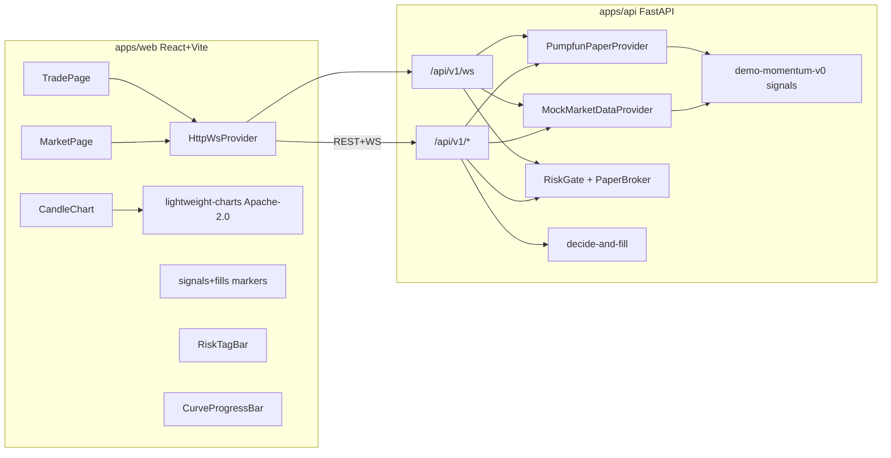

# 架构速览

- **Venue** `Pump.fun`（Solana bonding curve）when `DATA_PROVIDER=pumpfun_paper`。符号 = `PUMPDEMO/SOL` 等，报价 SOL。
- **默认** `DATA_PROVIDER=mock`：确定性 RNG 蜡烛 + 周期信号/成交/风控。
- **`DATA_PROVIDER=pumpfun_paper`**：本地 Pump.fun bonding-curve 模拟（venue=Pump.fun，paper-only）。`PUMPFUN_WATCH_MINTS` 白名单播种；无钱包、无 `sendTransaction`。进度条绑 `progress_bps` + `complete`/`migrated`。
- **下单**：始终 `PaperBroker` + `RiskGate`。`dataSource=mock|paper|pumpfun_paper` 与行情源正交；`paper` / `pumpfun_paper` overlay 只画 PaperBroker Fill。有 `ctx.pump` 时 `estimated_impact_bps` 走 bonding-curve（buy/`buy_tokens_out` vs sell/`sell_sol_out`），否则 CEX 平方根。
- **Trade UI**：`pre-order` → `paper/orders`；可选 `POST /api/v1/pipeline/decide-and-fill`。
- **禁止**：GPL fork（Freqtrade/FreqUI）、真实密钥、实盘下单、Jito tip / sniper、AGPL Yellowstone 嵌库。
- **后续**：`ccxt_public` / `dexscreener` provider（仅 public）。
