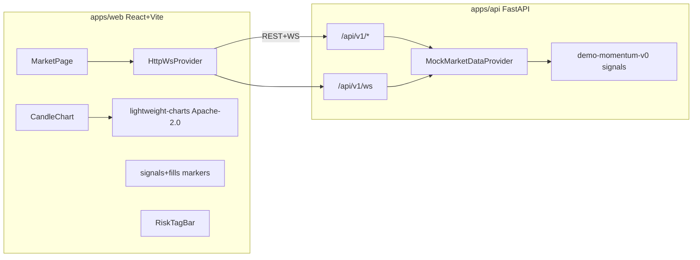

# 架构速览

```mermaid
flowchart LR
  subgraph web [apps/web React+Vite]
    MarketPage --> HttpWsProvider
    CandleChart --> LWC[lightweight-charts Apache-2.0]
    Overlay[signals+fills markers]
    RiskTagBar
  end
  subgraph api [apps/api FastAPI]
    REST["/api/v1/*"]
    WS["/api/v1/ws"]
    Mock[MockMarketDataProvider]
    Demo[demo-momentum-v0 signals]
  end
  HttpWsProvider -->|REST+WS| REST
  HttpWsProvider --> WS
  REST --> Mock
  WS --> Mock
  Mock --> Demo
```

- **默认** `DATA_PROVIDER=mock`：确定性 RNG 蜡烛 + 周期信号/成交/风控。
- **禁止**：GPL fork（Freqtrade/FreqUI）、真实密钥、实盘下单。
- **后续**：`ccxt_public` / `dexscreener` provider（仅 public）。
