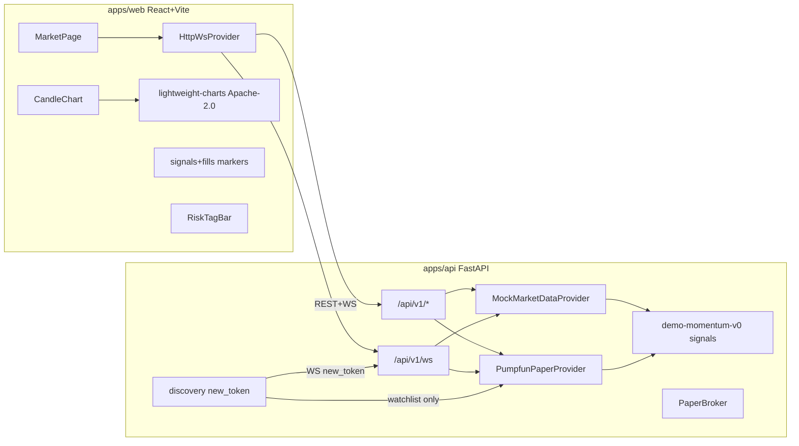

# 架构速览

- **默认** `DATA_PROVIDER=mock`：确定性 RNG 蜡烛 + 周期信号/成交/风控。
- **`DATA_PROVIDER=pumpfun_paper`**：本地 Pump.fun bonding-curve 模拟（venue=Pump.fun，paper-only）。`PUMPFUN_WATCH_MINTS` 白名单播种；只读发现 `PUMPFUN_DISCOVERY=pumpportal|logs|off` 可将 `new_token` 写入自选（不等于入场）。无钱包、无 `sendTransaction`。进度条绑 `progress_bps` + `complete`/`migrated`。
- **下单**：始终 `PaperBroker` + `RiskGate`（`dataSource=mock|paper` 与行情源正交）。有 `ctx.pump` 时 `estimated_impact_bps` 走 bonding-curve（buy/`buy_tokens_out` vs sell/`sell_sol_out`），否则 CEX 平方根。
- **禁止**：GPL fork（Freqtrade/FreqUI）、真实密钥、实盘下单、Jito tip / sniper、AGPL Yellowstone 嵌库。
- **后续**：`ccxt_public` / `dexscreener` provider（仅 public）。
