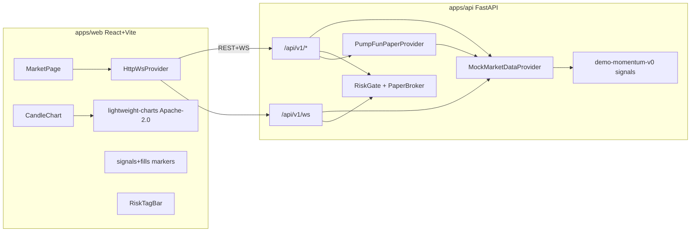

# 架构速览

- **Venue** `pump.fun`（Solana bonding curve）。符号 = mock mint / SOL，不是 CEX 现货对。
- **默认** `DATA_PROVIDER=mock`：确定性 RNG 蜡烛 + **曲线仿真**（virtual reserves / progress / 毕业迁移）。
- **`pumpfun_paper`**：`PumpFunPaperProvider` 槽位；v0 复用 mock 曲线，不接 live。
- **禁止**：GPL fork、钱包私钥、sniper、实盘下单。
- **纸面路径**：`pre-order` → `paper/orders`；可选 `POST /api/v1/pipeline/decide-and-fill`。
- **后续只读**：公开曲线账户数据；仍禁止 keys / auto-buy。
